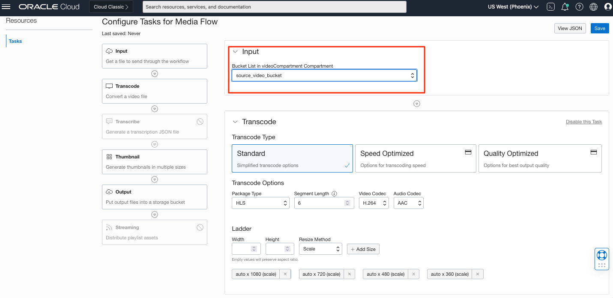
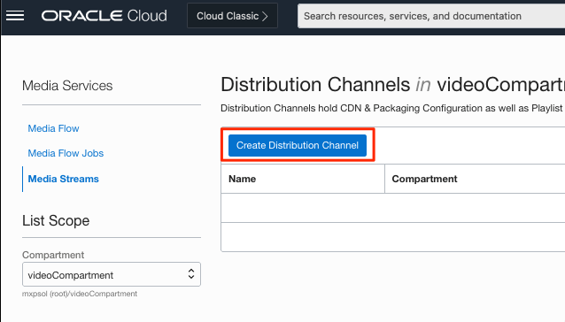
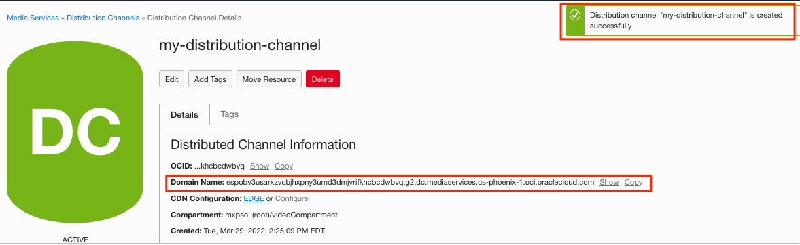
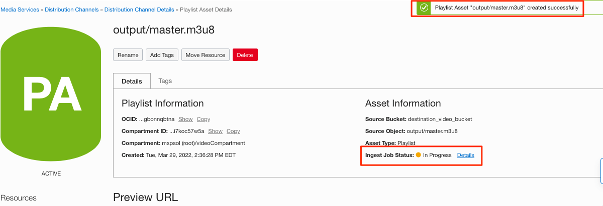
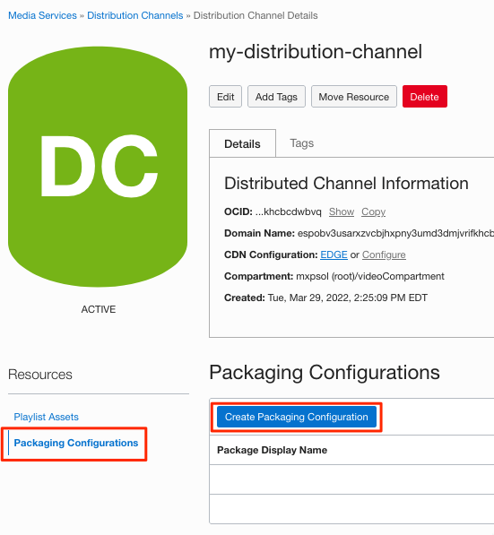
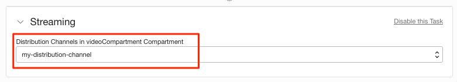
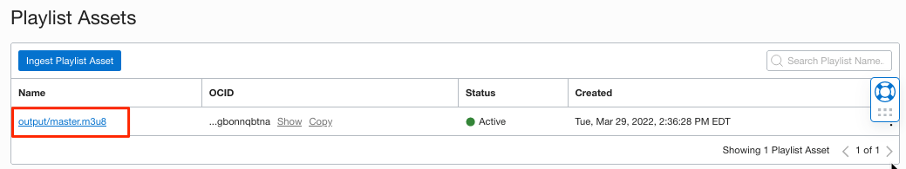

# Transcode and Stream your video using OCI Digital Media Services

## Introduction

This lab gives step by step guidance to transcode your video to formats which enables to stream the video using OCI.

Estimated Time: 90 minutes

### About Product
OCI Digital Media Services is region-based PaaS service for processing (transcoding) videos and stream the content with/without CDN along with options of generating thumbnails, speech to text as well.  The workshop intends to introduce the features of OCI Digital Media Services with a simple use case to stream the video of your choice through OCI.

#### Concepts

**Media Flows**

Media Flows is a regionally deployed, fully managed service for processing video (and audio) content. One of the main uses of the service is transcoding video into output formats suitable for streaming Video on Demand to various device types and desired resolutions. Media Flows simplifies the process for creating streaming formats from source content, so you don't need to worry about managing complex video processing infrastructure.

Media Flows works with the OCI Object Storage Service so you can provide source content in OCI Object Storage bucket and Media Flows performs specified transcoding operations to create Adaptive Bit Rate (ABR) package in OCI Object Storage bucket. The output from Media Flows can be delivered as streaming Video on Demand with OCI Media Streams Service or third-party systems that you may choose. Media Flows can also help with generating thumbnails for the video asset. 

* Media Workflow Task – Smallest defined work for processing to be done at a specific point in the workflow. 
A simple Media Workflow service consists of one of each below tasks: 
  * Get the Input media (media asset that is already uploaded in OCI Object Storage).
  * Transcode – This task creates multiple renditions for the media asset provided.
  * Thumbnail – Generates thumbnails for the media asset.
  * Output – Stores the output asset to OCI Object Storage. 
  * Streaming – Optionally the streaming channels can be preset after the media asset master playlist is created.
  * Transcription – Optionally you can generate the transcript of the media asset.
* 
* Media Workflow - customer-defined workflow to process media content that consist of one or more Media Workflow Tasks which defines the processing to be performed.
* Media Workflow Job - Jobs are used to "run" content through a workflow. Typically, a customer will define a handful of Media Workflows and use them to create many jobs. 
* Media Workflow Configuration – Re-usable configurations/parameters that can be used to create Media Workflow via API / CLI .
* OCI Object Storage – access to the buckets required for Media Services to read/write.

**Media Streams**

Media Streams is a regionally deployed, fully managed service providing scalable distribution and origination for just in time packaged ABR video content.  It includes packaging features for target format conversion (HLS/DASH), encryption (AES128) or using OCI KMS Service, session-based token, and video segmentation (in Seconds) for ABR streams.  Additionally, it provides secure and scalable distribution of the packaged ABR content using your AKAMAI CDN origination or directly from OCI edge services.   Media Streams simplifies the process for distribution and packaging of streaming formats from source content, so you don't need to worry about managing complex video packaging infrastructure.

Media Streams works by ingestion of HLS (m3u8 files) representing transcoded content residing in your Object Storage buckets.  Transcoded content can be created by OCI Media Flows or another external transcoding services if they comply with the ingest formats supported by Media Streams and reside in OCI Object Storage buckets. 

*	Distribution Channel - customer-defined combination of origination and packaging configurations.  
*	Packaging Configuration - customer-defined definition for HTTP Live Streaming (HLS) / DASH packaging of video content with optional Encryption.
*	CDN Config Section:  
  * No-CDN configuration allowing for streaming of just in time packaged video content directly from the OCI Edge location.
  * Akamai CDN – Integrate with your Akamai account and stream through Akamai.


### Objectives

In this lab, you will:
* Transcode your video to HLS (HTTP live streaming) format 
* Stream the transcoded video usign OCI

### Prerequisites

This lab assumes you have:

* An Oracle Free Tier, or Paid Cloud Account
* Able to create/update IAM policy.
* Familiar with OCI Object Storage usage.
  
## IAM Policy

The OCI Digital Media Service requires some of the other OCI services to function.
Identity Policies that define the level of access and access to a service. The supported verbs include, inspect, read, use & manage in the order of hierarchy access.

Two type of policies are needed to fully work on the labs for digital media services.

* Granting Group access to Digital Media Services
In your organization you may want to create groups to streamline the level of access based on the type of work.
For simplicity, we create below with any-user clause.
create new policy with below statement


Allow any-user to *verb* *entity* in tenancy

  ```
  allow any-user to use media-family in tenancy
  ```
  

The policy can be defined for users, resources (like OCI Compute or OCI Functions ) that need access to the media-family as well using dynamic groups.
You should be checking with your security team or IAM team to define more specific access. 


* Allow Digital Media Services to use other OCI services 
 The tasks in Media Flows & Media Services rely on permissions to be given for it to work. So, below are required.

    ```
      Allow service mediaservices to use object-family in compartment <<videoCompartment>>
      Allow service mediaservices to use keys in compartment <<videoCompartment>>
      Allow service mediaservices to read media-family in compartment <<videoCompartment>>
      Allow service mediaservices to manage ai-service-speech-family in compartment <<videoCompartment>>
    ```
  

## Task 1: Create Media Flows

Now that we have taken care of the IAM policy , we are ready to create our first Media Flow.
Create an OCI Object storage bucket and upload your video.
   Ensure the bucket is in the same compartment as the Media Services IAM policies defined.
    Else, you will face error like below while creating Media Flow.
    

|**Supported Input Content**|
|---|
|**Input formats** |
|3GP,ARF,ASF,AVI,P4V,FLV,M1V,M4V,MKV,MP4,MPG,MXF,OGG,OGM,OGV,QT,RM,RMVB,WAV,WEBM,WMA,WMV|
|**Input Video Codecs**|
|H263,H264,H265,MP43,DivX,Xvid,AVC,VP6,FLV1,FLV4,VP8,MPEG-1/2,AVC/MJPG,MPEG-4,Theora,WMV2|
|**Input Audio Codecs**|
|AAC,AAC/FLAC,MP3,EAC3,MP4A,PCM,Vorbis,RAW,WMA6/7,WMA8|

 
 <br>

1. Select "Media Services" and then "Media Flows" from OCI Main Me](images/04.png)
   This will take you the landing page of Media Flows.
2. Create the Media Flow . Remember to choose the correct compartment where the IAM policy is defined.
  
  Now you will be presented with options to customize your Media Flow

4. The tasks are presented in user friendly manner to select the input bucket from where the videos are taken in for processing.
    You may leave the other fields in transcode task as default for now.
5.  optionally, you can enable the transcribe task and it does not require any additional inputs.
    
6. The thumbnail task can also be left default configuration or disable the task if you don't need them in your first media flow.
    
7. Finally , select the output bucket where the transcoded video and audio files should be stored.
    
8. You may leave the last task streaming disabled for now and we will discuss this usage in the next section.
9. Save the media flow and provide a name for same.
     
     
10. Once saved, the confirmation is shown above and also prompt to run the job.
     
11. Go ahead and click "Run Job" and select your video that you want to transcode, hit Run job.
     
12. Once the job is submitted, you can watch the progress and wait for it to complete.
    you will notice the tasks will indicate the status in the media flow job. 
     
     

13. After the job completes, you can see the output files under the destination bucket.
     

## Task 2: Create Streaming Components

The Media Flow Job completion will bring below type of files:
* Master Playlist (master.m3u8)
* Individual playlist (other m3u8)
* Thumbnail images (jpg)
* Transcription in JSON format if enabled. (folder transcription)
 

1. Navigate to Media Streams section 
    
2. Create Distribution Channel
   
3. Keep the EDGE as CDN and provide a name to create the distribution channel.
   
4. Upon creation the distribution channel information are displayed.
   
   The domain name will be the streaming hostname.
5. Ingest the Master Playlist into the distribution channel
   
6. Select the destination bucket and output folder to choose the Master Playlist.
   Note: Selecting other playlist will result in error.
   
   Confirmation and status of the ingest job is shown 
   
7. Now we will work on the streaming packaging configuration
   
   Select HLS with 6 second as segment time and NONE for encryption. 
   

**Note:** Once you have the distribution channel created with the streaming packaging configurations, in the media flow task, you can select the existing streaming channel to ingest as soon as the transcode completes.


## Task 3: Stream the video

We have transcoded the source video into multiple bitrates and sizes.
Also, created the components required to stream the video content.

1. Navigate to the ingested master playlist in the distribution channel.
   
2. Look for the ingest job status successful and then select the packaging configuration in the preview URL section.
   
   Copy the URL which contains authenticated session key information for the streaming content.
3. Paste the URL in Safari or HLS Player. I use the Chrome Browser extension HLS Player 
   

## Acknowledgements
* **Author** - Sathya Mohankalyan - Oracle OCI Digital Media Services
* **Last Updated By/Date** - Sathya Mohankalyan, April 2022
